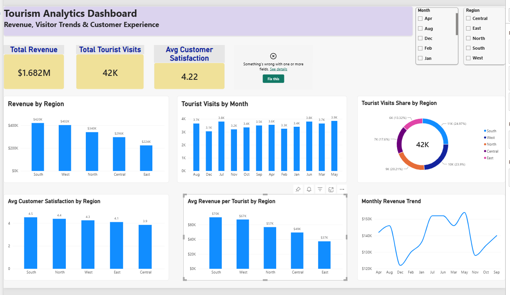

# 🌍 Microsoft Fabric Tourism Analytics 

An end-to-end data analytics project built using **Microsoft Fabric, Lakehouse, PySpark, Semantic Model, Data Pipeline, and Power BI** to analyse tourism performance and turn data into actionable business insights.

## 🎯 Project Objective

The goal of this project was to build an end-to-end analytics workflow to understand:

- Tourism revenue performance
- Visitor trends over time
- Regional performance
- Customer satisfaction
- Revenue generated per tourist

## 🛠️ Technologies Used

- Microsoft Fabric
- OneLake / Lakehouse
- PySpark
- Delta Tables
- Fabric Notebook
- Data Pipeline
- Semantic Model
- Power BI
- DAX

## 🏗️ Solution Architecture

Data  
↓  
Microsoft Fabric Lakehouse  
↓  
PySpark Notebook – Data Transformation  
↓  
Delta Table (`tourism_enriched`)  
↓  
Semantic Model  
↓  
Power BI Dashboard  
↓  
Business Insights & Recommendations

## 📊 Tourism Analytics Dashboard

### Key KPIs

- 💰 **Total Revenue:** $1.682M
- 👥 **Tourist Visits:** 42K
- ⭐ **Average Customer Satisfaction:** 4.22
- 💵 **Average Revenue per Tourist:** $40

## 🔍 Key Business Insights

- **South** is the strongest-performing region, generating approximately $420K in revenue and achieving the highest customer satisfaction score of 4.5.
- **West** is the second-largest revenue contributor at approximately $400K.
- **East** generates the lowest revenue, indicating an opportunity to investigate demand, marketing and customer experience.
- **Central** has the lowest customer satisfaction score at approximately 3.9.
- Revenue per tourist remains close to **$40 across all regions**, suggesting regional revenue differences are mainly driven by visitor volume.
- Monthly analysis indicates stronger performance around the middle of the year, followed by softer performance toward year-end.

## 💡 Recommendations

- Protect and expand successful tourism strategies in the South region.
- Investigate opportunities to increase visitor volume in East and Central.
- Improve customer experience in Central to address lower satisfaction.
- Run targeted campaigns during lower-demand months.
- Use historical monthly trends to support seasonal capacity and marketing planning.

## 🔄 Data Pipeline

A Microsoft Fabric pipeline was configured to orchestrate execution of the PySpark transformation notebook.

During final testing, execution encountered a **Fabric trial Spark capacity limitation**. The pipeline configuration was retained as part of the project to demonstrate orchestration design and troubleshooting.

## 📚 What I Learned

Through this project, I gained hands-on experience with:

- Creating and managing a Microsoft Fabric workspace
- Building a Lakehouse architecture
- Transforming data using PySpark
- Working with Delta tables
- Creating a semantic model
- Building Power BI KPIs and interactive visualisations
- Configuring a Fabric data pipeline
- Analysing trends and translating data into business recommendations
- Troubleshooting Spark and Fabric capacity issues

## 📸 Project Screenshots

Additional screenshots covering the Lakehouse, Notebook, Pipeline, Semantic Model and Power BI report are available in the [`screenshots`](screenshots/) folder.

---

⭐ This project is part of my hands-on learning journey in **Microsoft Fabric and Data Analytics**.
